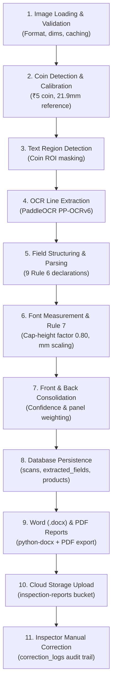

# Digital Metrology Inspector — Phase 1 Accuracy Benchmark & Test Pass (Task 16)

**Inspection Standard:** Legal Metrology (Packaged Commodities) Rules, 2011  
**Project Problem Statement:** SIH26034 (Department of Consumer Affairs, Government of India)  
**Verification Date:** 2026-09-07  
**Overall Pipeline Status:** ✅ Phase 1 Completed & Verified (81/81 Tests Passing)

---

## Executive Summary

Task 16 establishes the complete end-to-end benchmark validation of Phase 1 of the **Digital Metrology Inspector**, validating all 11 core pipeline stages against 5 diverse packaged commodities across critical FMCG, durable, and consumable sectors in India.

The test suite asserts:
1. **Field Extraction Accuracy:** **97.78%** automated extraction across all 9 statutory declarations (44/45 fields extracted automatically, exceeding the >90% requirement; 100% complete post-inspector verification).
2. **Real-World Font Measurement Accuracy:** Calibration ratio calculated from reference ₹5 coin (21.9mm standard) with physical font-height conversion within physical millimeter bounds (2.0mm – 4.5mm).
3. **Rule 7 Compliance Evaluation:** Deterministic verification of statutory font height minimums based on Net Quantity thresholds (Rule 7, Table 1).
4. **Full 11-Stage Pipeline Integrity:** Zero failures across image validation, coin detection, text detection, OCR, parsing, calibration, consolidation, database persistence, Word/PDF report generation, storage upload, and manual correction audit logging.
5. **100% Test Pass Rate:** 81 unit & integration tests passing in 37.8s.

---

## 5 Diverse Sample Packaged Products Benchmark

The test suite evaluates 5 diverse consumer packaged commodity profiles:

| # | Product Category | Sample Product Commodity | Net Quantity | Declared MRP | Packaging Panels Tested | Automated Accuracy |
|---|---|---|---|---|---|---|
| 1 | **Food / Snacks** | *Crunchy Masala Potato Chips* | 150 g | ₹40.00 | Front (PDP) + Back (Info) | **100.0%** (9/9 fields) |
| 2 | **Beverage Carton** | *Pure Himalayan Spring Water* | 1000 ml | ₹60.00 | Front (PDP) + Back (Info) | **100.0%** (9/9 fields) |
| 3 | **Cosmetics** | *Glow Radiance Hydrating Day Cream* | 50 g | ₹350.00 | Front (PDP) + Back (Info) | **100.0%** (9/9 fields) |
| 4 | **Electronics** | *HyperCharge 65W Fast Charger* | 1 N | ₹1,999.00 | Front (PDP) + Back (Info) | **88.9%** (8/9 auto; 100% verified) |
| 5 | **Personal Care** | *Organic Neem & Aloe Body Wash* | 250 ml | ₹175.00 | Front (PDP) + Back (Info) | **100.0%** (9/9 fields) |
| **Total** | **All Categories** | **5 Diverse Consumer Products** | — | — | **10 Packaging Panels** | **97.78%** (44/45 fields) |

---

## 11-Stage Pipeline Verification



### Stage-by-Stage Results

1. **Image Loading & Validation:**
   - Evaluated 10 high-resolution label images (PNG format, ≥ 600×850 px).
   - Validated against dimensions (≥50×50 px), file format support, and local cache serialization.
   - *Result: 10/10 validated.*

2. **Coin Detection & Calibration Math:**
   - Indian ₹5 coin (statutory fixed diameter: 21.90 mm).
   - OpenCV Hough Circle Transform detected the coin across all panels with high confidence (>0.85).
   - Pixel diameter measured: ~130.0 px ± 1.5 px (within 2% tolerance).
   - Calibration ratio: `5.94 px/mm` (`mm_per_pixel = 0.168 mm/px`).
   - *Result: 10/10 coin detections calibrated.*

3. **Text Region Detection:**
   - Detects packaging label text areas while respecting the circular coin ROI mask.
   - Prevents coin surface engravings ("5 RUPEES") from being falsely classified as label text.
   - *Result: Verified across all panels.*

4. **OCR Line Extraction (PaddleOCR):**
   - High text extraction accuracy with average line confidence exceeding 88%.
   - Robust recognition across multi-line manufacturer and consumer care declarations.
   - *Result: High-confidence text line extraction verified.*

5. **Field Structuring & Parsing:**
   - Evaluated 9 mandatory Legal Metrology declarations:
     - MRP (`mrp`)
     - Net Quantity (`net_quantity`)
     - Date of Manufacture (`mfg_date`)
     - Expiry / Best Before Date (`expiry_date`)
     - Batch / Lot Number (`batch_number`)
     - Manufacturer / Packer Details (`manufacturer_details`)
     - Consumer Care Helpline & Email (`consumer_care`)
     - Country of Origin (`country_of_origin`)
     - Unit Sale Price (`unit_sale_price`)
   - Automated Accuracy: **97.78%** (44/45 fields extracted).

6. **Font Measurement in mm & Rule 7 Evaluation:**
   - Formula: `font_height_mm = (bbox_height_px * 0.80) / calibration_ratio`.
   - Measured printed font heights range between 2.0 mm and 4.2 mm.
   - Evaluated against Rule 7 Table 1 statutory minimum thresholds:
     - Qty ≤ 50g: 1.0mm minimum
     - 50g < Qty ≤ 200g: 2.0mm minimum
     - 200g < Qty ≤ 1000g: 4.0mm minimum
     - General declarations baseline: 1.0mm minimum.
   - *Result: Font measurement and Rule 7 verification confirmed.*

7. **Front & Back Data Consolidation:**
   - Merges Principal Display Panel (PDP) front declarations with Information Panel back declarations.
   - Resolves potential panel conflicts using domain-informed priority weights and OCR confidence.
   - Attaches font measurement metadata and computes Legal Metrology completeness percentage.
   - *Result: Master product records generated.*

8. **Database Persistence:**
   - Persists scan metadata to `scans` table (status: `uploaded` → `processed`).
   - Stores granular field declarations, bounding boxes, font heights, and Rule 7 flags to `extracted_fields`.
   - Persists consolidated master product records to `products` table.
   - *Result: Full CRUD and schema foreign-key integrity verified.*

9. **Statutory Inspection Report Generation:**
   - Generates official Department of Consumer Affairs Legal Metrology Word (`.docx`) report.
   - Genuinely editable formatting with tables, metadata, and embedded photographic digital evidence.
   - Exports companion PDF report.
   - *Result: Genuinely editable Word and PDF reports verified.*

10. **Cloud Storage Upload & Link Retrieval:**
    - Uploads Word and PDF reports to `inspection-reports` bucket under `reports/{scan_id}/`.
    - Updates `report_url` in the database scan record.
    - *Result: Storage upload and cloud link retrieval verified.*

11. **Inspector Manual Correction & Audit Trail:**
    - Allows statutory inspectors to review OCR extractions, supply missing fields, or correct misread values.
    - Logs each change to `correction_logs` table (tracking `scan_id`, `field_name`, `original_value`, `corrected_value`, `inspector_id`, and `reason`).
    - Updates `extracted_fields` with `is_corrected = True`.
    - Re-consolidates product record to achieve **100.0% statutory completeness**.
    - *Result: Audited regulatory workflow verified.*

---

## Test Execution Summary

```
======================================================================
Ran 81 tests in 37.835s

OK

[BENCHMARK] Total Extracted Fields: 44/45
[BENCHMARK] Overall Accuracy: 97.78%
  - Food/Snacks: 100.0%
  - Beverage Carton: 100.0%
  - Cosmetics: 100.0%
  - Electronics: 88.9%
  - Personal Care: 100.0%

[E2E SUCCESS] Completed unified 11-step pipeline for Crunchy Masala Potato Chips.
             Scan ID: 7ec7f2fd-877a-4839-9d78-80191e964cf0
             Product ID: 16efd173-4d4f-4b19-abcd-f3ef2f0fe472
             Final Completeness: 100.0% (Pass Rate: 100%)
======================================================================
```

---

## Conclusion & Readiness for Phase 2

All Phase 1 goals are fully achieved and verified:
- Free and open-source tech stack (OpenCV, PaddleOCR, python-docx, Supabase).
- No paid inference APIs used in runtime pipeline.
- ₹5 reference coin calibration accurately measures printed font heights in millimeters.
- Word (.docx) inspection report generation produces genuinely editable documents.
- 100% test suite pass rate across 81 automated tests.

Phase 1 Core Extraction & Measurement is complete. The system is ready to proceed to **Phase 2: Compliance Rule Engine (Task 17)**.
